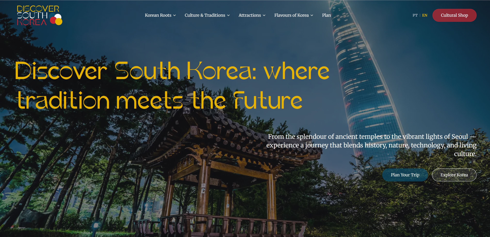
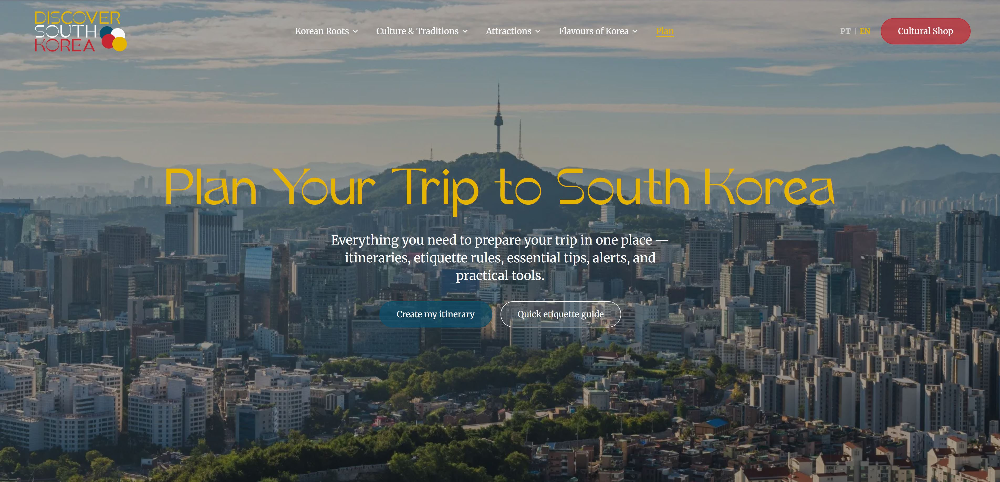
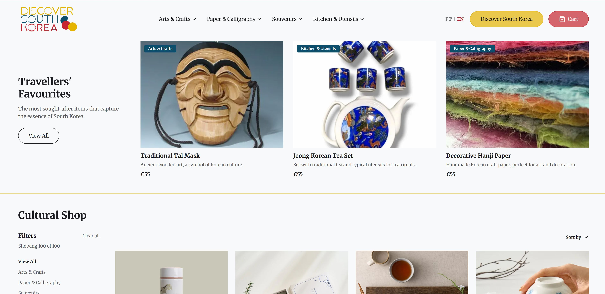

# Discover South Korea — Where Tradition Meets Future

> A multilingual travel and e-commerce site built from original Figma designs created through a complete UX/UI design process.

[](https://south-korea-tourism.vercel.app/en)
[](https://www.figma.com/design/SNeJGjAqrFxggtFu3tNGLF/Turismo-na-Coreia-do-Sul?node-id=0-1&t=c57SLqOFNOCpS9li-1)

---

## About

Discover South Korea is a portfolio project that spans the full product lifecycle — from UX research to a live, production-ready web application.

It started as the final project of a UX/UI course at **[IEFP](https://www.iefp.pt)** (Instituto do Emprego e Formação Profissional), Portugal. Every phase of the design process was completed before a single line of code was written. As a frontend developer, I then turned those designs into a fully implemented Next.js application — completing the arc from research to shipped product.

---

## UX Design Process

1. **Research & problem definition** — identifying the target audience, context, and content requirements for a South Korea tourism platform
2. **Personas & user journeys** — mapping realistic user scenarios to inform structure and content priorities
3. **Wireframes & prototyping** — low-to-mid fidelity wireframes evolving into a fully interactive Figma prototype
4. **High-fidelity UI** — complete design system, component library, and polished screens in Figma

**[View the Figma project →](https://www.figma.com/design/SNeJGjAqrFxggtFu3tNGLF/Turismo-na-Coreia-do-Sul?node-id=0-1&t=c57SLqOFNOCpS9li-1)**

---

## Preview





---

## Features

### Discovery (`/`)

- **Hero** — full-screen background with heading and CTA
- **Highlights** — icon grid introducing South Korea's culture, history, nature, and lifestyle
- **Events** — seasonal Korean events and festivals with imagery
- **Inspiration** — curated travel photography and destinations
- **Proverbs** — Korean proverbs with translations
- **Safety tips** — practical travel safety information
- **Shop CTA** — cross-link into the cultural shop

### Plan (`/plan`)

- **Travel kit** — icon grid of essential travel considerations
- **Itineraries** — suggested trip plans across different durations and themes
- **Etiquette** — guide to Korean customs and social norms
- **Essentials** — practical logistics covering transport, currency, and connectivity
- **Alerts** — travel advisories and important notices
- **Downloads** — accordion UI listing categorised resources (PDF itineraries, maps, checklists, documents) — faithful implementation of the Figma design

### Shop (`/shop`)

- **Featured products** — highlighted items at the top of the catalogue
- **Product catalogue** — grid of cultural goods: arts & crafts, paper goods, kitchen utensils, and souvenirs
- **Filtering** — filter by category with multi-select checkboxes
- **Search** — text search across the catalogue
- **Sorting** — sort by price or name
- **Pagination** — client-side page navigation
- **Mobile filter drawer** — offcanvas filter panel for small screens

### Cross-cutting

- Fully **bilingual** — Portuguese (`pt`, default) and English (`en`) with locale-based URL routing
- **Dark theme** (Discovery + Plan) and **light theme** (Shop)
- **Responsive** — mobile-first layout with breakpoints for all screen sizes
- **Scroll-aware navbar** — transparent on load, solid background on scroll
- **OG & Twitter metadata** — dynamic Open Graph image generated with `next/og`
- **Vercel Analytics** — page view tracking with zero configuration

---

## Tech Stack

| Technology | Version | Purpose |
|---|---|---|
| [Next.js](https://nextjs.org/) | 16.1.1 | React framework with App Router |
| [React](https://react.dev/) | 19 | UI rendering |
| [TypeScript](https://www.typescriptlang.org/) | ^5 | Type safety |
| [Tailwind CSS](https://tailwindcss.com/) | ^4 | Utility-first styling |
| [next-intl](https://next-intl.dev/) | ^4 | Internationalisation & locale routing |
| [Vercel Analytics](https://vercel.com/analytics) | ^1 | Page view analytics |

---

## Project Structure

```
app/
├── [locale]/                          # Dynamic locale segment (pt, en)
│   ├── layout.tsx                     # NextIntlClientProvider + Vercel Analytics
│   ├── opengraph-image.tsx            # Dynamic OG image (next/og)
│   ├── (main)/                        # Discovery section (dark theme)
│   │   ├── layout.tsx                 # Main navbar + footer
│   │   ├── page.tsx                   # Home page
│   │   └── plan/page.tsx              # Planning page
│   └── (shop)/                        # Shop section (light theme)
│       ├── layout.tsx                 # Shop navbar + footer
│       └── shop/page.tsx              # Shop catalogue page
├── components/
│   ├── layout/
│   │   ├── Navbar.tsx                 # Shared navbar (dark / light themes)
│   │   ├── Footer.tsx                 # Shared footer (dark / light themes)
│   │   ├── MobileMenuContext.tsx      # Shared mobile menu state
│   │   ├── MobileMenuOverlay.tsx      # Main site mobile menu
│   │   ├── ShopMobileMenuOverlay.tsx  # Shop mobile menu
│   │   ├── MainNavActions.tsx         # Action buttons for main navbar
│   │   └── ShopNavActions.tsx         # Action buttons for shop navbar
│   ├── main/                          # Home page sections
│   │   ├── HeroSection.tsx
│   │   ├── EventsSection.tsx
│   │   ├── InspirationSection.tsx
│   │   ├── ProverbsSection.tsx
│   │   ├── SafetySection.tsx
│   │   └── ShopCtaSection.tsx
│   ├── plan/                          # Planning page sections
│   │   ├── PlanHeroSection.tsx
│   │   ├── ItinerariesSection.tsx
│   │   ├── EtiquetteSection.tsx
│   │   ├── EssentialsSection.tsx
│   │   ├── AlertsSection.tsx
│   │   └── DownloadsSection.tsx
│   ├── shop/                          # Shop components
│   │   ├── ShopFeaturedSection.tsx
│   │   ├── ShopProductsSection.tsx
│   │   ├── ShopProductCard.tsx
│   │   ├── ProductCard.tsx
│   │   ├── ShopFilters.tsx
│   │   ├── FilterTag.tsx
│   │   ├── MobileFilterDrawer.tsx
│   │   └── ShopPagination.tsx
│   ├── AccentCard.tsx                 # Card with accent border
│   ├── Button.tsx                     # Button (primary / secondary)
│   ├── HtmlLang.tsx                   # Sets html[lang] from active locale
│   ├── IconGridSection.tsx            # Reusable icon grid (highlights, travel kit)
│   ├── Icons.tsx                      # Centralised SVG icon components
│   ├── LanguageSwitcher.tsx           # PT / EN toggle
│   └── SectionHeader.tsx             # Reusable section heading block
├── data/                              # Static content & configuration
│   ├── navigationData.ts              # Main site nav items
│   ├── shopNavigationData.ts          # Shop nav items
│   ├── footerData.ts                  # Main footer (brand info, links, social)
│   ├── shopFooterData.ts              # Shop footer links
│   ├── highlightsData.ts              # Cultural highlights for the home page grid
│   ├── eventsData.ts                  # Korean events and festivals
│   ├── inspirationData.ts             # Travel inspiration articles
│   ├── proverbsData.ts                # Korean proverbs with translations
│   ├── safetyData.ts                  # Travel safety tips
│   ├── travelKitData.ts               # Travel kit items for the plan page grid
│   ├── itinerariesData.ts             # Trip itinerary cards
│   ├── etiquetteData.ts               # Korean etiquette tips
│   ├── essentialsData.ts              # Travel essentials (transport, currency, etc.)
│   ├── alertsData.ts                  # Travel alerts and advisories
│   ├── downloadsData.ts               # Downloadable resource categories and items
│   ├── shopProductsData.ts            # Featured shop products
│   ├── shopAllProductsData.ts         # Full product catalogue
│   └── shopFiltersData.ts             # Filter options (categories, price, region, etc.)
├── hooks/
│   └── useScrolled.ts                 # Scroll-position detection
├── i18n/
│   ├── routing.ts                     # Locale list & default locale
│   ├── navigation.ts                  # Locale-aware Link / useRouter
│   └── request.ts                     # Server-side message loading
├── messages/
│   ├── en.json                        # English translations
│   └── pt.json                        # Portuguese translations
├── utils/
│   ├── localize.ts                    # LocalizedString type + localize()
│   └── formatContent.tsx              # Markdown bold → React element parser
├── globals.css                        # Global styles & Tailwind theme
├── layout.tsx                         # Root layout (fonts + SEO metadata)
└── i18n.d.ts                          # TypeScript types for next-intl
```

---

## Design System

### Colour Palette

| Token | Value | Usage |
|---|---|---|
| `inkstone` | `#1b1b1e` | Primary text, dark backgrounds |
| `porcelain` | `#f8f9fa` | Light backgrounds, light text |
| `harvest` | `#e4b400` | Golden accent, active states |
| `crimson` | `#c62631` | Red accent, alerts, CTAs |
| `celestial` | `#0b4f6c` | Deep blue accent, focus rings |

### Typography

Two font families are configured as Tailwind utilities:

- `font-heading` — Korean display font (local, `/public/fonts/Korean.ttf`)
- `font-body` — Merriweather serif (Google Fonts)

Font sizes use fluid scaling between 375 px and 1440 px viewports:

| Token | Mobile | Desktop |
|---|---|---|
| `text-heading-xl` | 48px | 96px |
| `text-heading-lg` | 40px | 64px |
| `text-heading-md` | 24px | 32px |
| `text-heading-sm` | 20px | 24px |
| `text-body-xl` | 18px | 24px |
| `text-body-lg` | 16px | 18px |
| `text-body-md` | 16px | 16px |
| `text-body-sm` | 14px | 14px |

---

## Internationalisation

The site supports **Portuguese** (`pt`, default) and **English** (`en`) via next-intl with URL-based locale routing.

| URL | Content |
|---|---|
| `/pt` | Portuguese home page |
| `/en` | English home page |
| `/pt/plan` | Portuguese planning page |
| `/en/shop` | English shop page |

Visiting `/` redirects automatically to `/pt`.

**Translation files** live in `app/messages/en.json` and `app/messages/pt.json`.

**Localised data** uses the `LocalizedString` type for any content field that differs between languages:

```ts
// utils/localize.ts
export interface LocalizedString {
  pt: string;
  en: string;
}

export function localize(value: LocalizedString, locale: Locale): string {
  return value[locale];
}
```

Usage in components:

```tsx
import { useLocale } from "next-intl";
import { localize } from "@/utils/localize";

const locale = useLocale() as Locale;
<h2>{localize(item.title, locale)}</h2>
```

---

## Getting Started

**Prerequisites:** Node.js 18+ and npm.

```bash
# 1. Clone the repository
git clone https://github.com/agrandemartasan/south-korea-tourism.git
cd south-korea-tourism

# 2. Install dependencies
npm install

# 3. Start the development server
npm run dev
```

Open [http://localhost:3000](http://localhost:3000) in your browser. The app redirects automatically to the default locale (`/pt`).

---

## Available Scripts

| Script | Command | Description |
|---|---|---|
| Dev server | `npm run dev` | Starts Next.js in development mode with hot reload |
| Build | `npm run build` | Creates an optimised production build |
| Lint | `npm run lint` | Runs ESLint across the project |

---

## Deployment

Deployed on [Vercel](https://vercel.com) — [south-korea-tourism.vercel.app](https://south-korea-tourism.vercel.app/en).

---

## Author

**Marta Carneiro** — [LinkedIn](https://www.linkedin.com/in/marta--carneiro/)
